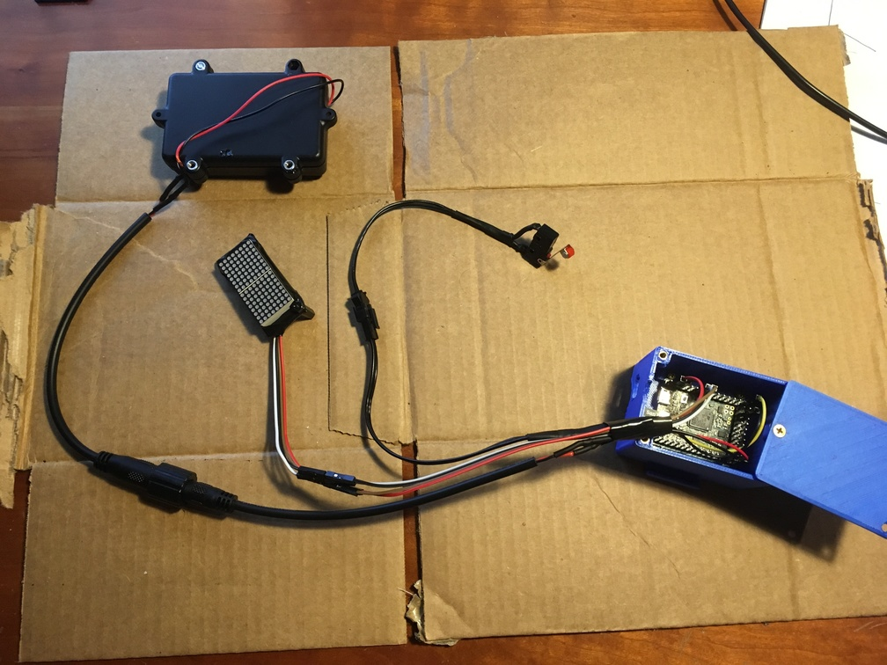

# Building an Automatic Bicycle Brake Light

When I finished my data science certificate program at Georgetown, I wanted a fun project where I could practice my machine learning. I had recently learned about the [Pyboard](https://store.micropython.org/), a microcontroller that runs Python code directly - so no need to learn C++ quite yet. I prefer projects that I can put into use in the real world, and I bike a lot, so I decided to build a bicycle brake light that could use accelerometer data to detect braking and light up the brake lights automatically without the need to install a switch on the brakes themselves. Let's see how it's done!

## The setup

This is a classification problem, where we have two classes ('braking' or 'not braking'). The end goal is to have a brake light that uses just accelerometer data to identify braking. First, though, we need some labeled data so we can design an algorithm that can identify braking in the future. What we need to do:

1. Make a data logger that includes a switch that is triggered when the brake handle is pulled.

2. Ride the bike around and log some data.

3. Run the machine learning workflow - feature selection, algorithm tuning, etc. - to create an algorithm that can correctly predict braking in our logged data.

4. Get rid of the switch and light up our brake lights using accelerometer data alone. 

## The data logger

This has two parts, the physical system to attach the Pyboard to the bike and connect to the brakes, and the code to log the data. 

### Physical

First I 3D printed a housing for the Pyboard that I could attach directly to the bike. It's important it be connected to the frame (rather than say in a saddle bag) so that the acceleration is transmitted directly to the board. The housing is a lot larger than it would need to be long term so that different equipment could be rewired into it easily for prototyping purposes.

The brake switch proved to be much harder, and nearly derailed the project when my first couple attempts didn't work. Figuring out a good, safe way to connect an electronic switch to the brakes without impeding braking was a bit tricky. I ended up using a microswitch with a roller lever attached near the exposed brake wire. I attached a plastic nub to a fixed spot on the wire so that when the brake lever was pulled it actuated the lever.

Finally, to give myself some reinforcement that the switch was being activated correctly I connected an LED matrix that would get turned on (via software, not hardwired) when the switch was activated. In the code you'll see the light matrix code only gets run when data logging is occuring. Here's the whole system wired up and attached to the bike. Zip ties and picture hanging command strips hold it together, but quick and simple is better since this particular setup since it's only temporary. 

    

    

### Data Logging Code

While it was nice to write Python code directly for a microcontroller, getting the data logger up and running had lots of new things to learn. Running on a microcontroller and controlling physical hardware has lots of differences than running normally. 

Here's a snippet of the main logging loop. We wait for the user to press the 'start logging' button on the Pyboard. Then we enter a 2-second calibration mode, where the bike should be upright and still - this allows us to calculate the mounting angle of the board (as pictured above, about 45 degrees). This is necessary since we'll want to adjust our X/Y/Z acceleration values appropriately if we used a model trained on this data with a brake light mounted on a different part of the bike. Finally we start logging accelerometer data. The blue and orange LEDs are to show the user the status (calibration or data logging mode). 

[See all the source code here](https://github.com/NealHumphrey/bike_brake_light/tree/master/code_pyboard)

## Learning from our data

To start out I went out and collected two bike rides worth of data on two separate days. With that we have the X/Y/Z acceleration plus the label (brake/no brake) for every 20ms (50X per second). This is probably more frequent than needed, but I figured let's start with this - and for example if we need to combine readings to average out any bumps this gives us plenty of resolution to work with. 

As a first pass, I wanted to see what would happen if I just threw the raw data at some classification algorithms. This would also give me a chance to get a workflow and some evaluation methods set up. To be clear, I thought it would be highly unlikely that this would yield a good model, but it's a place to start. 

Braking is far less frequent than non-braking, so I did go ahead and upsample to get a balanced data set - this would keep our models from getting "good" accuracy by just guessing not braking all the time. Here's some of the core code copied out; you can see the full usage in this [Jupyter Notebook](https://github.com/NealHumphrey/bike_brake_light/blob/master/code_model_selection/simple_ml_analysis.ipynb)

How'd we do? To test, I trained the model on one of the bike rides, and then tested it on another to guarantee that the data was totally unseen (no leakage). A random forest had an accuracy of about 80% - ok, but not super great, especially considering that included lots of 'easy' time of data logged before and after I started riding. And that's averaging boBut we're taking each individual reading as a completely separate observation, out of context, so a small bump in the road could look a lot like braking for 1/50th of a second. Each observation has context - the prior readings - since braking usually occurs for a contiguous section of time. Is that 80% accuracy well distributed? These graphs help understand it better - the top is the brake / no brake status of the logged data on the second ride, while the row below is the prediction. 

<!---->

<h4>K Nearest Neighbors</h4>

<h4>Random Forest</h4>

<h4>Support Vector Machine</h4>

Yeah - definitely not a performance model. Every little bump in the road comes through as fake braking. But we do have a couple strong clusters during actual braking - the middle bar in particular (I must have braked especially hard that time or something). In any case we now have a good way to view our results and visualize the performance of the model without having to install it into the bike yet. 

## What's next

As I said, this analysis so far is very early - it's just throwing some raw data at our models. We need to do some feature selection and tune things up some more. 

Some next steps:
- Smoothing of observations with a rolling average
- Context of changes - change in acceleration, previous acceleration readings, etc.
- Adjust the upsampling to take whole blocks of braking instead of individual readings
- Rotate the x/y/z readings into an absolute coordinate system
- Train models to identify things other than true/false - for example, identify the end of a braking event, which might have a characteristic acceleration signature from the release of the brake handle. 
- Lots more

More to come soon!
